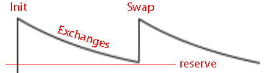
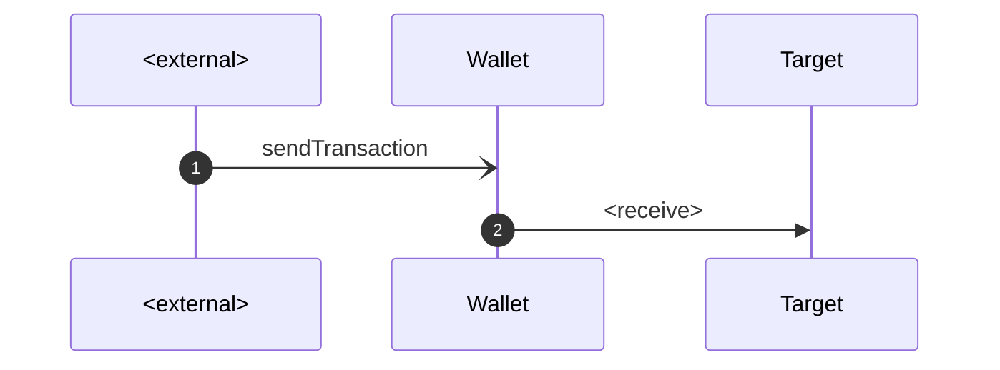
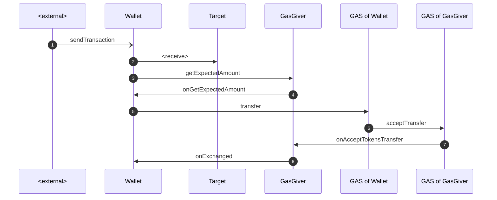

# Gasless Wallet

Project Github: https://github.com/tonred/GaslessWallet

MainNet Gas Giver: `0:2a281c76625457a06f9edaed1411f56ddeda785c9d10838baaeb938f590f9d94`

MainNet Sample Wallet: `0:43bd147bae7959bbe98f6ffba7beb1494fa3411f8bf985b9d38f387f046f7932`

MainNet Gas Token Root: `0:f4a105beea18e3da096865ca6f0cc9e0885fcf464838ffa291841aa876485b61`

TG: @Abionics, @get_username

## Key features:
* Infinity amount of wallets, no huge mapping
* High bandwidth, swap and wallet minimize count of swaps
* Swapping Gas Token in popular Flatqube Dex
* All edge cases are covered


## Technical description

### Abstract

Project contains two contract types: GasGiver and GaslessWallet.
GasGiver is used to swap Gas Token to EVERs for user, and
any TIP3.2 token can be used as Gas Token. GaslessWallet is a
wallet that has significant amount of Gas Token and use GasGiver
in order to exchange Gas Token to EVERs. One GasGiver can support
infinite amount of GaslessWallet

### Basic terminology

* **Gas Token** - TIP3.2 token that will be exchanged to gas (EVERs)
* **Exchange** - exchange Gas Token to EVERs in GasGiver. It can call DEX swap, but
also can do it without calling DEX swap (and this is more often case)
* **Swap** - swap Gas Token to EVERs in DEX (Flatqube). Only GasGiver can call this
action in this implementation

### Abstract Gasless Wallet

Any contract can inherit from abstract [GaslessWallet](contracts/GaslessWallet.sol).
When child contract is initialized, it must an `_init` method of GaslessWallet.
Child contract must already have Gas Token wallet and pass it in `_init`.
See [SampleWallet](contracts/tests/SampleWallet.sol) for example.

Gasless Wallet has two main values - `minBalance` and `minReserve` (`minBalance < minReserve`).
**The main logic** can be divided is 3 possible cases (here `value` is transaction values that must be sent):
1) `(balance - value) > minReserve` - too many EVERs, transaction can be executed immediately (no message to GasGiver at all)
2) `minReserve ≥ (balance - value) ≥ minBalance` - transaction can be executed immediately, and another transaction
to GasGiver must be sent for exchanging
3) `minBalance > (balance - value)` - transaction cannot be executed, firstly Gas Token must be exchanged to EVERs.
So GaslessWallet safe transaction in memory and waiting for EVERs (case 1 or 2)

### Gas Giver

Gas Giver is contact that exchange Gas Token to EVERs. In order to optimize gas usage and
minimize DEX calls, it exchanges Gas Token only when it doesn't have enough EVERs in balance.
So exchanges can be represented as batches (see graphic bellow)


There are some config params that are set on deploy:
1) `tokenRoot` - Gas Token
2) `dexPair` - DEX pair address
3) `slippage` - exchange slippage for user Wallets (in `Constants.PERCENT_DENOMINATOR` unit)
4) `feePercent` - exchange fee that taken by GasGiver (in `Constants.PERCENT_DENOMINATOR` unit)
5) `maxGas` - maximum amount of EVERs to exchange (get) in one transaction
6) `reserve` - minimum reserve value in Gas Giver

### Workflow

As described in [Gasless Wallet](#Abstract-Gasless-Wallet), there are 3 possible cases.
The first case is clear and looks like this:


The another two cases are triggers GasGiver. Depending on it balance, there are 2 possible cases.
If GasGiver have enough EVERs than GasGiver do simple exchange (without DEX swap). More formally:
```math
remains = max(balance - reserve, 0)
remains ≥ expectedGas
```

And diagrams looks like this:


In other case (when `remains < expectedGas`), GasGiver calls DEX swap and then burn WEVERs to get EVERs.
It looks like this:

```mermaid
sequenceDiagram
    autonumber

    external -) 043bd147bae7959bbe98f6ffba7beb1494fa3411f8bf985b9d38f387f046f7932: sendTransaction
    043bd147bae7959bbe98f6ffba7beb1494fa3411f8bf985b9d38f387f046f7932 ->>+ 02a281c76625457a06f9edaed1411f56ddeda785c9d10838baaeb938f590f9d94: getExpectedAmount
    02a281c76625457a06f9edaed1411f56ddeda785c9d10838baaeb938f590f9d94 ->>- 043bd147bae7959bbe98f6ffba7beb1494fa3411f8bf985b9d38f387f046f7932: onGetExpectedAmount
    043bd147bae7959bbe98f6ffba7beb1494fa3411f8bf985b9d38f387f046f7932 ->> 00fed97ef18ae99889d3b6d037a9af4135ddcd168a905b4d108949af5467020ef: transfer
    00fed97ef18ae99889d3b6d037a9af4135ddcd168a905b4d108949af5467020ef ->> 08dd1346804b74c5cd622df69b0af5aa70c00af857f6a594498714d3c24b4f8cf: acceptTransfer
    08dd1346804b74c5cd622df69b0af5aa70c00af857f6a594498714d3c24b4f8cf ->>+ 02a281c76625457a06f9edaed1411f56ddeda785c9d10838baaeb938f590f9d94: onAcceptTokensTransfer
    02a281c76625457a06f9edaed1411f56ddeda785c9d10838baaeb938f590f9d94 ->>- 043bd147bae7959bbe98f6ffba7beb1494fa3411f8bf985b9d38f387f046f7932: onExchanged
    043bd147bae7959bbe98f6ffba7beb1494fa3411f8bf985b9d38f387f046f7932 ->> 0fa94171cb0565789224814561cc558e59315971ee9d03085de3dcb5f8b94d95e: #60;receive#62;
    043bd147bae7959bbe98f6ffba7beb1494fa3411f8bf985b9d38f387f046f7932 ->>+ 02a281c76625457a06f9edaed1411f56ddeda785c9d10838baaeb938f590f9d94: getExpectedAmount
    02a281c76625457a06f9edaed1411f56ddeda785c9d10838baaeb938f590f9d94 ->>- 043bd147bae7959bbe98f6ffba7beb1494fa3411f8bf985b9d38f387f046f7932: onGetExpectedAmount
    043bd147bae7959bbe98f6ffba7beb1494fa3411f8bf985b9d38f387f046f7932 ->> 00fed97ef18ae99889d3b6d037a9af4135ddcd168a905b4d108949af5467020ef: transfer
    00fed97ef18ae99889d3b6d037a9af4135ddcd168a905b4d108949af5467020ef ->> 08dd1346804b74c5cd622df69b0af5aa70c00af857f6a594498714d3c24b4f8cf: acceptTransfer
    08dd1346804b74c5cd622df69b0af5aa70c00af857f6a594498714d3c24b4f8cf ->>+ 02a281c76625457a06f9edaed1411f56ddeda785c9d10838baaeb938f590f9d94: onAcceptTokensTransfer
    02a281c76625457a06f9edaed1411f56ddeda785c9d10838baaeb938f590f9d94 --) external: Swap
    alt Gas -> Wever Swap
        02a281c76625457a06f9edaed1411f56ddeda785c9d10838baaeb938f590f9d94 ->>- 08dd1346804b74c5cd622df69b0af5aa70c00af857f6a594498714d3c24b4f8cf: transfer
        08dd1346804b74c5cd622df69b0af5aa70c00af857f6a594498714d3c24b4f8cf ->> 0e6c45de0acb643c1a79a9b57d1f9064e3c9349bedb0c5c6feb9c6a884850c113: acceptTransfer
        0e6c45de0acb643c1a79a9b57d1f9064e3c9349bedb0c5c6feb9c6a884850c113 ->> 063f194a0c323b953a3ed9f4c927e687e363e934cd272faca14dd62e82ea6e638: onAcceptTokensTransfer
        063f194a0c323b953a3ed9f4c927e687e363e934cd272faca14dd62e82ea6e638 --) external: Exchange
        063f194a0c323b953a3ed9f4c927e687e363e934cd272faca14dd62e82ea6e638 -x 02a281c76625457a06f9edaed1411f56ddeda785c9d10838baaeb938f590f9d94: dexPairExchangeSuccess [e60]
        063f194a0c323b953a3ed9f4c927e687e363e934cd272faca14dd62e82ea6e638 ->> 0e6c45de0acb643c1a79a9b57d1f9064e3c9349bedb0c5c6feb9c6a884850c113: transfer
        0e6c45de0acb643c1a79a9b57d1f9064e3c9349bedb0c5c6feb9c6a884850c113 ->> 01e38fe6d405f447d879bb621152284e0b2a7da6aca12171ef4393c8b02e20971: acceptTransfer
        01e38fe6d405f447d879bb621152284e0b2a7da6aca12171ef4393c8b02e20971 ->> 02a281c76625457a06f9edaed1411f56ddeda785c9d10838baaeb938f590f9d94: #60;receive#62;
        063f194a0c323b953a3ed9f4c927e687e363e934cd272faca14dd62e82ea6e638 ->> 06fa537fa97adf43db0206b5bec98eb43474a9836c016a190ac8b792feb852230: transfer
        06fa537fa97adf43db0206b5bec98eb43474a9836c016a190ac8b792feb852230 --) external: PairTransferTokens
        06fa537fa97adf43db0206b5bec98eb43474a9836c016a190ac8b792feb852230 ->> 04a64bb41cb22e0fd85b42ddc20da31a90c6939677db3b09b1b369a01ae814cc9: transfer
        04a64bb41cb22e0fd85b42ddc20da31a90c6939677db3b09b1b369a01ae814cc9 ->> 0ce5af5ed17e067f1e9bc2a053f349f532a612b6571278220db826b25d26a4267: acceptTransfer
    0ce5af5ed17e067f1e9bc2a053f349f532a612b6571278220db826b25d26a4267 ->>+ 02a281c76625457a06f9edaed1411f56ddeda785c9d10838baaeb938f590f9d94: onAcceptTokensTransfer
    end
    alt Wever Burn
        02a281c76625457a06f9edaed1411f56ddeda785c9d10838baaeb938f590f9d94 ->>- 0ce5af5ed17e067f1e9bc2a053f349f532a612b6571278220db826b25d26a4267: transfer
        0ce5af5ed17e067f1e9bc2a053f349f532a612b6571278220db826b25d26a4267 ->> 0c37ae5e710b5d1d9c8aa803f9029e5ae778066e937d94d2f47b567747171c853: acceptTransfer
        0c37ae5e710b5d1d9c8aa803f9029e5ae778066e937d94d2f47b567747171c853 ->> 0557957cba74ab1dc544b4081be81f1208ad73997d74ab3b72d95864a41b779a4: onAcceptTokensTransfer
        0557957cba74ab1dc544b4081be81f1208ad73997d74ab3b72d95864a41b779a4 ->> 0c37ae5e710b5d1d9c8aa803f9029e5ae778066e937d94d2f47b567747171c853: burn
        0c37ae5e710b5d1d9c8aa803f9029e5ae778066e937d94d2f47b567747171c853 ->> 0a49cd4e158a9a15555e624759e2e4e766d22600b7800d891e46f9291f044a93d: acceptBurn
        0a49cd4e158a9a15555e624759e2e4e766d22600b7800d891e46f9291f044a93d ->>+ 02a281c76625457a06f9edaed1411f56ddeda785c9d10838baaeb938f590f9d94: onAcceptTokensBurn
    end
    02a281c76625457a06f9edaed1411f56ddeda785c9d10838baaeb938f590f9d94 ->>- 043bd147bae7959bbe98f6ffba7beb1494fa3411f8bf985b9d38f387f046f7932: onExchanged
    063f194a0c323b953a3ed9f4c927e687e363e934cd272faca14dd62e82ea6e638 --) external: #60;unknown#62;
    063f194a0c323b953a3ed9f4c927e687e363e934cd272faca14dd62e82ea6e638 --) external: Sync

    participant external as #60;external#62;
    participant 00fed97ef18ae99889d3b6d037a9af4135ddcd168a905b4d108949af5467020ef as GAS of Wallet
    participant 063f194a0c323b953a3ed9f4c927e687e363e934cd272faca14dd62e82ea6e638 as GAS-WEVER
    participant 01e38fe6d405f447d879bb621152284e0b2a7da6aca12171ef4393c8b02e20971 as GAS of FlatqubeVault
    participant 0a49cd4e158a9a15555e624759e2e4e766d22600b7800d891e46f9291f044a93d as WEVER
    participant 0fa94171cb0565789224814561cc558e59315971ee9d03085de3dcb5f8b94d95e as Target
    participant 0e6c45de0acb643c1a79a9b57d1f9064e3c9349bedb0c5c6feb9c6a884850c113 as GAS of GAS-WEVER
    participant 043bd147bae7959bbe98f6ffba7beb1494fa3411f8bf985b9d38f387f046f7932 as Wallet
    participant 02a281c76625457a06f9edaed1411f56ddeda785c9d10838baaeb938f590f9d94 as GasGiver
    participant 04a64bb41cb22e0fd85b42ddc20da31a90c6939677db3b09b1b369a01ae814cc9 as WEVER of FlatqubeVault
    participant 0557957cba74ab1dc544b4081be81f1208ad73997d74ab3b72d95864a41b779a4 as WeverVault
    participant 06fa537fa97adf43db0206b5bec98eb43474a9836c016a190ac8b792feb852230 as FlatqubeVault
    participant 08dd1346804b74c5cd622df69b0af5aa70c00af857f6a594498714d3c24b4f8cf as GAS of GasGiver
    participant 0c37ae5e710b5d1d9c8aa803f9029e5ae778066e937d94d2f47b567747171c853 as WEVER of WeverVault
    participant 0ce5af5ed17e067f1e9bc2a053f349f532a612b6571278220db826b25d26a4267 as WEVER of GasGiver
```


By the way, there is one extremely rare case, when price of Gas Token in pool changed significantly
and there is not enough EVERs even after swap. This means that Gasless must send additional Gas Tokens
to complete another swap and get enough EVERs

```mermaid
sequenceDiagram
    autonumber

    external -) 0a2eb3117c82f5dad5287b49900371cd3ef0637d810baf332fc28ca733f16ea48: sendTransaction
    0a2eb3117c82f5dad5287b49900371cd3ef0637d810baf332fc28ca733f16ea48 ->> 0848298508401ef8edad108ed72c7fbe9e02a4e55fc88485bc04c16eacbf0ec15: getExpectedAmount
    0848298508401ef8edad108ed72c7fbe9e02a4e55fc88485bc04c16eacbf0ec15 ->> 0a2eb3117c82f5dad5287b49900371cd3ef0637d810baf332fc28ca733f16ea48: onGetExpectedAmount
    0a2eb3117c82f5dad5287b49900371cd3ef0637d810baf332fc28ca733f16ea48 ->> 09b67dccf0997e2417a6a37450a996595e58368f7c40e36b8ec9cc0f6826c3367: transfer
    09b67dccf0997e2417a6a37450a996595e58368f7c40e36b8ec9cc0f6826c3367 ->> 03f04cfa0b8ec920221f15f31ab08523abdd98ca345860e6711c52c1aae915529: acceptTransfer
    03f04cfa0b8ec920221f15f31ab08523abdd98ca345860e6711c52c1aae915529 ->> 0848298508401ef8edad108ed72c7fbe9e02a4e55fc88485bc04c16eacbf0ec15: onAcceptTokensTransfer
    0848298508401ef8edad108ed72c7fbe9e02a4e55fc88485bc04c16eacbf0ec15 --) external: Swap
    alt Gas -> Wever Swap
        0848298508401ef8edad108ed72c7fbe9e02a4e55fc88485bc04c16eacbf0ec15 ->> 03f04cfa0b8ec920221f15f31ab08523abdd98ca345860e6711c52c1aae915529: transfer
        03f04cfa0b8ec920221f15f31ab08523abdd98ca345860e6711c52c1aae915529 ->> 0e6c45de0acb643c1a79a9b57d1f9064e3c9349bedb0c5c6feb9c6a884850c113: acceptTransfer
        0e6c45de0acb643c1a79a9b57d1f9064e3c9349bedb0c5c6feb9c6a884850c113 ->> 063f194a0c323b953a3ed9f4c927e687e363e934cd272faca14dd62e82ea6e638: onAcceptTokensTransfer
        063f194a0c323b953a3ed9f4c927e687e363e934cd272faca14dd62e82ea6e638 --) external: Exchange
        063f194a0c323b953a3ed9f4c927e687e363e934cd272faca14dd62e82ea6e638 -x 0848298508401ef8edad108ed72c7fbe9e02a4e55fc88485bc04c16eacbf0ec15: dexPairExchangeSuccess [e60]
        063f194a0c323b953a3ed9f4c927e687e363e934cd272faca14dd62e82ea6e638 ->> 0e6c45de0acb643c1a79a9b57d1f9064e3c9349bedb0c5c6feb9c6a884850c113: transfer
        0e6c45de0acb643c1a79a9b57d1f9064e3c9349bedb0c5c6feb9c6a884850c113 ->> 01e38fe6d405f447d879bb621152284e0b2a7da6aca12171ef4393c8b02e20971: acceptTransfer
        01e38fe6d405f447d879bb621152284e0b2a7da6aca12171ef4393c8b02e20971 ->> 0848298508401ef8edad108ed72c7fbe9e02a4e55fc88485bc04c16eacbf0ec15: #60;receive#62;
        063f194a0c323b953a3ed9f4c927e687e363e934cd272faca14dd62e82ea6e638 ->> 06fa537fa97adf43db0206b5bec98eb43474a9836c016a190ac8b792feb852230: transfer
        06fa537fa97adf43db0206b5bec98eb43474a9836c016a190ac8b792feb852230 --) external: PairTransferTokens
        06fa537fa97adf43db0206b5bec98eb43474a9836c016a190ac8b792feb852230 ->> 04a64bb41cb22e0fd85b42ddc20da31a90c6939677db3b09b1b369a01ae814cc9: transfer
        04a64bb41cb22e0fd85b42ddc20da31a90c6939677db3b09b1b369a01ae814cc9 ->> 07f4f2fb6cceadbf504640d8b864a5e7c0994838650acda7c0c6c00d1ff22d655: acceptTransfer
        07f4f2fb6cceadbf504640d8b864a5e7c0994838650acda7c0c6c00d1ff22d655 ->> 0848298508401ef8edad108ed72c7fbe9e02a4e55fc88485bc04c16eacbf0ec15: onAcceptTokensTransfer
    end
    alt Wever Burn
        0848298508401ef8edad108ed72c7fbe9e02a4e55fc88485bc04c16eacbf0ec15 ->> 07f4f2fb6cceadbf504640d8b864a5e7c0994838650acda7c0c6c00d1ff22d655: transfer
        07f4f2fb6cceadbf504640d8b864a5e7c0994838650acda7c0c6c00d1ff22d655 ->> 0c37ae5e710b5d1d9c8aa803f9029e5ae778066e937d94d2f47b567747171c853: acceptTransfer
        0c37ae5e710b5d1d9c8aa803f9029e5ae778066e937d94d2f47b567747171c853 ->> 0557957cba74ab1dc544b4081be81f1208ad73997d74ab3b72d95864a41b779a4: onAcceptTokensTransfer
        0557957cba74ab1dc544b4081be81f1208ad73997d74ab3b72d95864a41b779a4 ->> 0c37ae5e710b5d1d9c8aa803f9029e5ae778066e937d94d2f47b567747171c853: burn
        0c37ae5e710b5d1d9c8aa803f9029e5ae778066e937d94d2f47b567747171c853 ->> 0a49cd4e158a9a15555e624759e2e4e766d22600b7800d891e46f9291f044a93d: acceptBurn
        0a49cd4e158a9a15555e624759e2e4e766d22600b7800d891e46f9291f044a93d ->> 0848298508401ef8edad108ed72c7fbe9e02a4e55fc88485bc04c16eacbf0ec15: onAcceptTokensBurn
    end
    0848298508401ef8edad108ed72c7fbe9e02a4e55fc88485bc04c16eacbf0ec15 ->> 0a2eb3117c82f5dad5287b49900371cd3ef0637d810baf332fc28ca733f16ea48: onExchanged
    0a2eb3117c82f5dad5287b49900371cd3ef0637d810baf332fc28ca733f16ea48 ->> 0fa94171cb0565789224814561cc558e59315971ee9d03085de3dcb5f8b94d95e: #60;receive#62;
    0a2eb3117c82f5dad5287b49900371cd3ef0637d810baf332fc28ca733f16ea48 ->> 0848298508401ef8edad108ed72c7fbe9e02a4e55fc88485bc04c16eacbf0ec15: getExpectedAmount
    0848298508401ef8edad108ed72c7fbe9e02a4e55fc88485bc04c16eacbf0ec15 ->> 0a2eb3117c82f5dad5287b49900371cd3ef0637d810baf332fc28ca733f16ea48: onGetExpectedAmount
    0a2eb3117c82f5dad5287b49900371cd3ef0637d810baf332fc28ca733f16ea48 ->> 09b67dccf0997e2417a6a37450a996595e58368f7c40e36b8ec9cc0f6826c3367: transfer
    09b67dccf0997e2417a6a37450a996595e58368f7c40e36b8ec9cc0f6826c3367 ->> 03f04cfa0b8ec920221f15f31ab08523abdd98ca345860e6711c52c1aae915529: acceptTransfer
    03f04cfa0b8ec920221f15f31ab08523abdd98ca345860e6711c52c1aae915529 ->> 0848298508401ef8edad108ed72c7fbe9e02a4e55fc88485bc04c16eacbf0ec15: onAcceptTokensTransfer
    0848298508401ef8edad108ed72c7fbe9e02a4e55fc88485bc04c16eacbf0ec15 --) external: Swap
    alt Gas -> Wever Swap
        0848298508401ef8edad108ed72c7fbe9e02a4e55fc88485bc04c16eacbf0ec15 ->> 03f04cfa0b8ec920221f15f31ab08523abdd98ca345860e6711c52c1aae915529: transfer
        03f04cfa0b8ec920221f15f31ab08523abdd98ca345860e6711c52c1aae915529 ->> 0e6c45de0acb643c1a79a9b57d1f9064e3c9349bedb0c5c6feb9c6a884850c113: acceptTransfer
        0e6c45de0acb643c1a79a9b57d1f9064e3c9349bedb0c5c6feb9c6a884850c113 ->> 063f194a0c323b953a3ed9f4c927e687e363e934cd272faca14dd62e82ea6e638: onAcceptTokensTransfer
        063f194a0c323b953a3ed9f4c927e687e363e934cd272faca14dd62e82ea6e638 --) external: Exchange
        063f194a0c323b953a3ed9f4c927e687e363e934cd272faca14dd62e82ea6e638 -x 0848298508401ef8edad108ed72c7fbe9e02a4e55fc88485bc04c16eacbf0ec15: dexPairExchangeSuccess [e60]
        063f194a0c323b953a3ed9f4c927e687e363e934cd272faca14dd62e82ea6e638 ->> 0e6c45de0acb643c1a79a9b57d1f9064e3c9349bedb0c5c6feb9c6a884850c113: transfer
        0e6c45de0acb643c1a79a9b57d1f9064e3c9349bedb0c5c6feb9c6a884850c113 ->> 01e38fe6d405f447d879bb621152284e0b2a7da6aca12171ef4393c8b02e20971: acceptTransfer
        01e38fe6d405f447d879bb621152284e0b2a7da6aca12171ef4393c8b02e20971 ->> 0848298508401ef8edad108ed72c7fbe9e02a4e55fc88485bc04c16eacbf0ec15: #60;receive#62;
        063f194a0c323b953a3ed9f4c927e687e363e934cd272faca14dd62e82ea6e638 ->> 06fa537fa97adf43db0206b5bec98eb43474a9836c016a190ac8b792feb852230: transfer
        06fa537fa97adf43db0206b5bec98eb43474a9836c016a190ac8b792feb852230 --) external: PairTransferTokens
        06fa537fa97adf43db0206b5bec98eb43474a9836c016a190ac8b792feb852230 ->> 04a64bb41cb22e0fd85b42ddc20da31a90c6939677db3b09b1b369a01ae814cc9: transfer
        04a64bb41cb22e0fd85b42ddc20da31a90c6939677db3b09b1b369a01ae814cc9 ->> 07f4f2fb6cceadbf504640d8b864a5e7c0994838650acda7c0c6c00d1ff22d655: acceptTransfer
        07f4f2fb6cceadbf504640d8b864a5e7c0994838650acda7c0c6c00d1ff22d655 ->> 0848298508401ef8edad108ed72c7fbe9e02a4e55fc88485bc04c16eacbf0ec15: onAcceptTokensTransfer
    end
    alt Wever Burn
        0848298508401ef8edad108ed72c7fbe9e02a4e55fc88485bc04c16eacbf0ec15 ->> 07f4f2fb6cceadbf504640d8b864a5e7c0994838650acda7c0c6c00d1ff22d655: transfer
        07f4f2fb6cceadbf504640d8b864a5e7c0994838650acda7c0c6c00d1ff22d655 ->> 0c37ae5e710b5d1d9c8aa803f9029e5ae778066e937d94d2f47b567747171c853: acceptTransfer
        0c37ae5e710b5d1d9c8aa803f9029e5ae778066e937d94d2f47b567747171c853 ->> 0557957cba74ab1dc544b4081be81f1208ad73997d74ab3b72d95864a41b779a4: onAcceptTokensTransfer
        0557957cba74ab1dc544b4081be81f1208ad73997d74ab3b72d95864a41b779a4 ->> 0c37ae5e710b5d1d9c8aa803f9029e5ae778066e937d94d2f47b567747171c853: burn
        0c37ae5e710b5d1d9c8aa803f9029e5ae778066e937d94d2f47b567747171c853 ->> 0a49cd4e158a9a15555e624759e2e4e766d22600b7800d891e46f9291f044a93d: acceptBurn
        0a49cd4e158a9a15555e624759e2e4e766d22600b7800d891e46f9291f044a93d ->> 0848298508401ef8edad108ed72c7fbe9e02a4e55fc88485bc04c16eacbf0ec15: onAcceptTokensBurn
    end
    0848298508401ef8edad108ed72c7fbe9e02a4e55fc88485bc04c16eacbf0ec15 ->> 0a2eb3117c82f5dad5287b49900371cd3ef0637d810baf332fc28ca733f16ea48: onExchanged
    063f194a0c323b953a3ed9f4c927e687e363e934cd272faca14dd62e82ea6e638 --) external: #60;unknown#62;
    063f194a0c323b953a3ed9f4c927e687e363e934cd272faca14dd62e82ea6e638 --) external: Sync
    063f194a0c323b953a3ed9f4c927e687e363e934cd272faca14dd62e82ea6e638 --) external: #60;unknown#62;
    063f194a0c323b953a3ed9f4c927e687e363e934cd272faca14dd62e82ea6e638 --) external: Sync

    participant external as #60;external#62;
    participant 063f194a0c323b953a3ed9f4c927e687e363e934cd272faca14dd62e82ea6e638 as GAS-WEVER
    participant 01e38fe6d405f447d879bb621152284e0b2a7da6aca12171ef4393c8b02e20971 as GAS of FlatqubeVault
    participant 0a2eb3117c82f5dad5287b49900371cd3ef0637d810baf332fc28ca733f16ea48 as Wallet
    participant 0a49cd4e158a9a15555e624759e2e4e766d22600b7800d891e46f9291f044a93d as WEVER
    participant 0fa94171cb0565789224814561cc558e59315971ee9d03085de3dcb5f8b94d95e as Target
    participant 0e6c45de0acb643c1a79a9b57d1f9064e3c9349bedb0c5c6feb9c6a884850c113 as GAS of GAS-WEVER
    participant 0848298508401ef8edad108ed72c7fbe9e02a4e55fc88485bc04c16eacbf0ec15 as GasGiver
    participant 04a64bb41cb22e0fd85b42ddc20da31a90c6939677db3b09b1b369a01ae814cc9 as WEVER of FlatqubeVault
    participant 0557957cba74ab1dc544b4081be81f1208ad73997d74ab3b72d95864a41b779a4 as WeverVault
    participant 09b67dccf0997e2417a6a37450a996595e58368f7c40e36b8ec9cc0f6826c3367 as GAS of Wallet
    participant 06fa537fa97adf43db0206b5bec98eb43474a9836c016a190ac8b792feb852230 as FlatqubeVault
    participant 07f4f2fb6cceadbf504640d8b864a5e7c0994838650acda7c0c6c00d1ff22d655 as WEVER of GasGiver
    participant 0c37ae5e710b5d1d9c8aa803f9029e5ae778066e937d94d2f47b567747171c853 as WEVER of WeverVault
    participant 03f04cfa0b8ec920221f15f31ab08523abdd98ca345860e6711c52c1aae915529 as GAS of GasGiver
```

<details>
<summary>Diagram of this magic is under the spoiler</summary>



</details>

## Additional Functions

GasGiver has some methods only for owner:
* `drain(amount)` - drain amount EVERs
* `withdraw(isToken, amount)` - withdraw TIP3.2 tokens.
If `isToken` then withdraw Gas Token, otherwise withdraw WEVERs


## Deploy

### Requirements

* [locklift](https://www.npmjs.com/package/locklift) `1.5.3`
* [everdev](https://github.com/tonlabs/everdev) with compiler `0.63.0`, linker `0.15.70`
* python `3.10`
* nodejs

### Deploy

```shell
# 1) Setup
npm run setup
```

```shell
# 2) Build
npm run build
```

```shell
# 3) Deploy
npn run deploy-gas-giver
npn run deploy-sample-wallet
```


## Compatibility

GaslessWallet triggered via `_sendTransaction` function in it, that
accepts [Transaction](contracts/structures/Transaction.sol) object that
looks like common transaction data. That's why GaslessWallet can be used
as default SafeMultisig wallet
